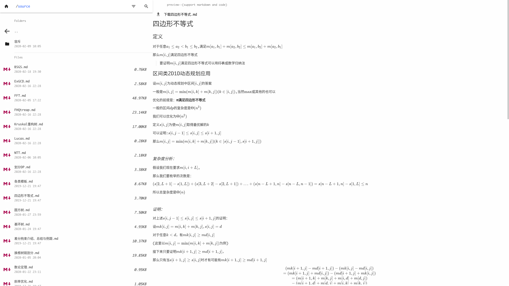

## 简介

 一个**美观**的供**静态网站**(如github pages)使用的**目录列表**程序,支持**搜索和预览**,支持代码和**markdown**的预览(支持**latex**)

使用python编写

[demo](https://codes.zcmimi.top/f_index.html)

## 特点

-  静态网页
-  简洁,美观
-  支持筛选和搜索
-  预览使用`markedjs`和`katex`高速渲染
-  `latex`
   -  行外高亮请使用`$$...$$`
   -  行内高亮请使用`$...$`
-  采用`highlight.js`可自定义代码高亮
-  自动识别当前目录中是否已有网站

## 初步使用

1. 将`add,dirgen.py,dirgen-content-right.txt,search.html`复制根目录
2. 运行`dirgen.py`会在各个目录下生成`f_index.html`

## 配置方法

1. **站名**

   >  修改`dirgen.py`中的`site_name`

2. 自定义`css`

   >  对`add/custom.css`进行添加或修改

3. **自定义搜索**

   >  考虑到这是静态网站,搜索文件采用生成文件来辅助搜索
   >
   >  请向`dirgen.py`中的`search_typlist`添加或删除要支持搜索的文件后缀
   >
   >  请根据网站加载速度,自行调节`dirgen.py`中的`search_each_file_length`来限制每个文件向辅助文件中添加文本的长度,以防止辅助文件过大,提高搜索时加载速度

## todo list

- [ ] 添加移动端支持
- [ ] 添加其他功能与调整
- [ ] 添加夜间主题

## 本项目使用到的其它项目:

1. [mdui](https://github.com/zdhxiong/mdui)
2. [marked](https://github.com/markedjs/marked)
3. [katex](https://github.com/KaTeX/KaTeX)
4. [jQuery](https://github.com/jquery/jquery)
