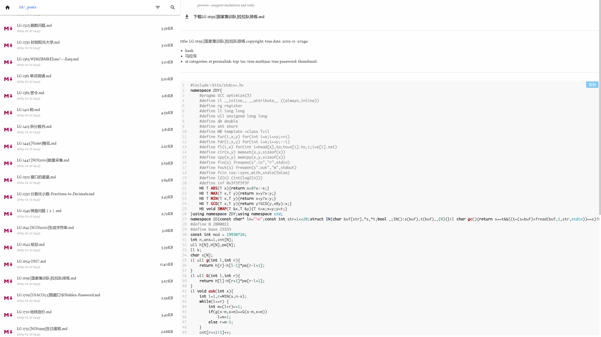

## 简介

 一个**美观**的供**静态网站**(如github pages)使用的**目录列表**程序,支持代码和**markdown**的预览(支持**latex**)

使用python编写 

[demo](https://codes.zcmimi.top/f_index.html)

## 使用方法

1. 将`dirgen.py,dirgen-content-right.txt,add`复制根目录
2. 运行`dirgen.py`会在各个目录下生成`f_index.html`

其中`add`文件夹中存放的是所需的`css`,`js`文件

`dirgen-content-right.txt`中是预览窗口的html代码还有其他配件(如代码高亮,markdown转html)

自定义`css`可以在`add/custom.css`中添加

## to do

- [ ] 添加移动端支持
- [ ] 添加搜索和筛选功能
- [ ] 添加其他功能与调整

~~很有可能咕咕咕了~~

## 本项目使用到的其它项目:

1. [mdui](https://github.com/zdhxiong/mdui)
2. [texme](https://github.com/susam/texme)